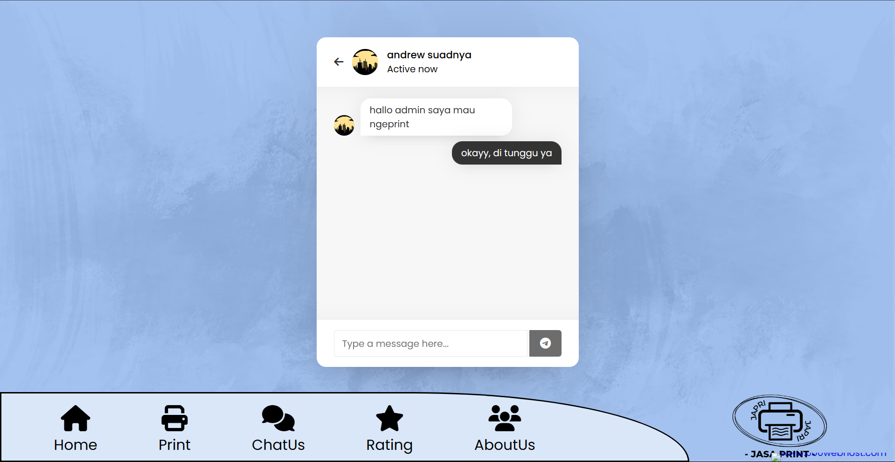

# JAPRI Website

This repository contains the source code for the JAPRI website project. JAPRI stands for "Jasa Print", which is an online platform providing printing services.

## Table of Contents

- [About](#about)
- [Technologies Used](#technologies-used)
- [Navigation](#navigation)
- [Footer Links](#footer-links)
- [Logo](#logo)

## About

The JAPRI website is designed to offer printing services online. It provides a convenient platform for users to access printing services from the comfort of their homes. The website features a sleek design and easy navigation to enhance user experience.

## Technologies Used

- HTML5
- CSS3
- Font Awesome 6.4.0
- JavaScript
- PHP
- MySQL

## Navigation

The website features a navigation bar with links to various sections:

- **SignUp**: Directs users to the signup page for creating a new account and accessing additional features.
- **Login**: Allows users to log in to their accounts for access to personalized features.
- **Home**: Takes users to the homepage.
- **Print**: Directs users to the printing services page.
- **ChatUs**: Provides a link to a chat feature for customer support.
- **Rating**: Leads users to the rating page for feedback submission.
- **AboutUs**: Navigates users to the About Us section to learn more about the company.

    

        
    

    

        
    

    

        
    

    

        
    

    

        
    

    

        
    

    

        
    

    

        
    

    

        
    

## Footer Links

The footer section contains quick access links to different pages of the website, providing users with easy navigation options.

## Logo

The website displays the JAPRI logo at the bottom, providing branding consistency throughout the site.

## Website Link

You can access the JAPRI website by following this link: [JAPRI Website](https://japrint.000webhostapp.com/)

---

© 2023 JAPRI
